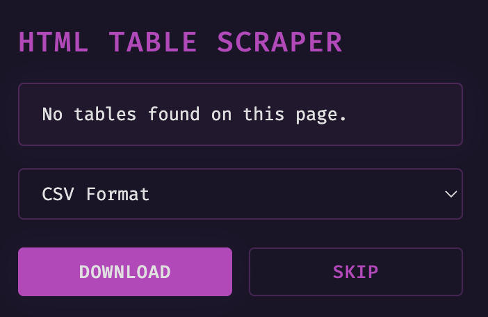

# HTML Table Scraper Chrome Extension

A Chrome extension that helps you extract tables from web pages and download them as CSV or JSON files.

## Features

- Automatically detects all `<table>` elements on the current webpage
- Highlights the currently selected table
- Allows you to download tables in either CSV or JSON format
- Shows table dimensions (rows × columns)
- Skip to next table if you don't want to download the current one

## Installation

1. Clone or download this repository
2. Open Chrome and go to `chrome://extensions/`
3. Enable "Developer mode" in the top right corner
4. Click "Load unpacked" and select the directory containing these files

## Usage

1. Navigate to any webpage containing tables
2. Click the Table Scraper extension icon in your Chrome toolbar
3. The extension will show you the first table found on the page
4. Choose your preferred format (CSV or JSON)
5. Click "Download" to save the table or "Skip" to move to the next table

## UI

## File Structure

- `manifest.json`: Extension configuration
- `popup.html`: Extension popup interface
- `popup.js`: Popup interface logic
- `content.js`: Webpage interaction logic
- `background.js`: Background tasks
- `icons/`: Extension icons

## Note

This extension only works with standard HTML tables (using the `<table>` tag). It does not detect tables created using other HTML elements like `
`.

## License

MIT License.
